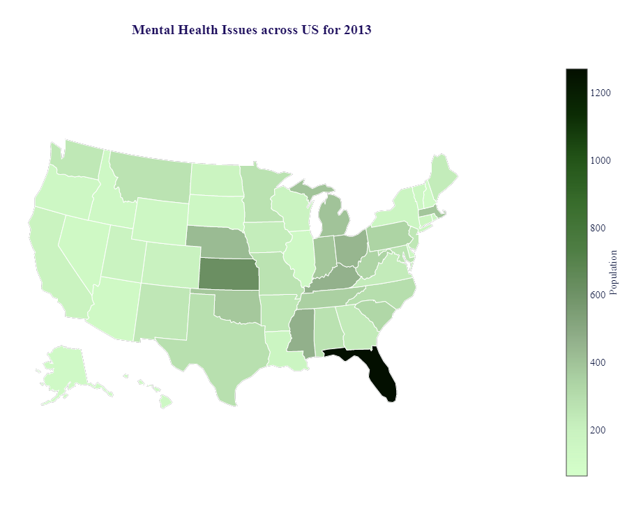
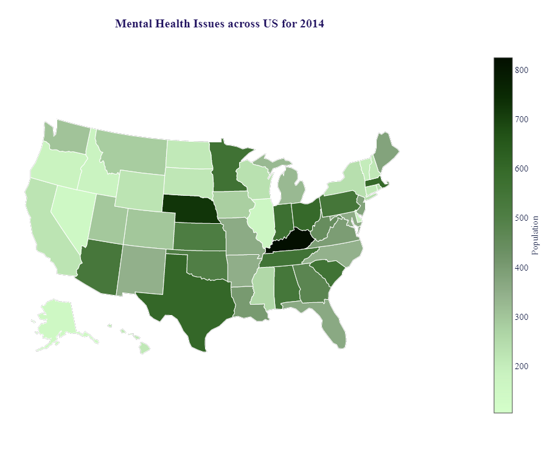
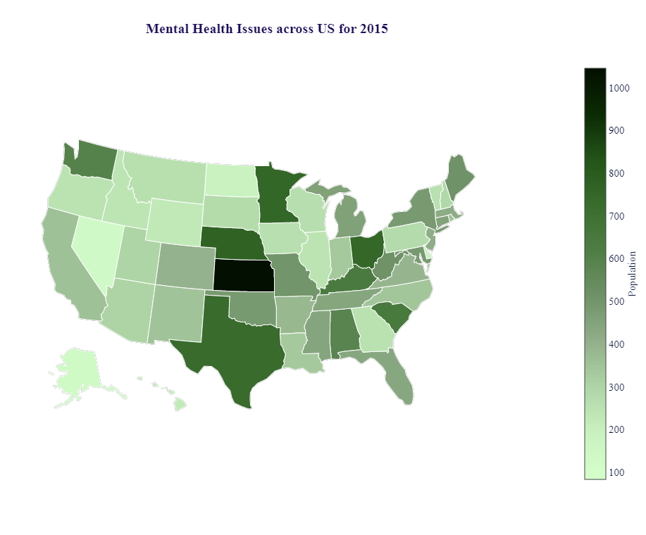

# Mental Health Analysis across US from 2012-2016

The project analyses the Mental Health across the United States based on the data from Behavioral Risk Factor Surveillance System (BRFSS) survey conducted by Centers for Disease Control and Prevention.

The Behavioral Risk Factor Surveillance System (BRFSS) is the nation's premier system of health-related telephone surveys that collect state data about U.S. residents regarding their health-related risk behaviors, chronic health conditions, and use of preventive services.BRFSS now collects data in all 50 states as well as the District of Columbia and three U.S. territories. BRFSS completes more than 400,000 adult interviews each year, making it the largest continuously conducted health survey system in the world.

By collecting behavioral health risk data at the state and local level, BRFSS has become a powerful tool for targeting and building health promotion activities due to which we utilized the BRFSS survey as the key data source for this project.

## Trends over the years 2012 - 2016 across United States

### 2012

### 2013

### 2014

### 2015

### 2016

* Other Trends based on Filters such as Age, Employment Status, Race, Gender, Rural or Urban and Health Coverage has been plotted and the analysis results are available under Analysis_Output.

